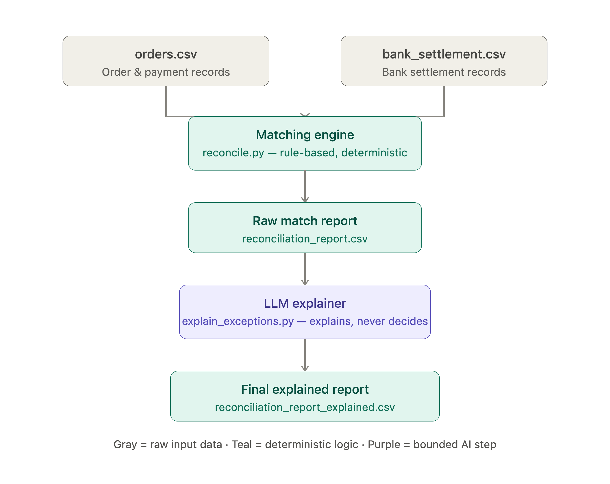

# AI Finance Controller — Payment Reconciliation Agent

Built for the **Razorpay AI Buildathon — Track 4: AI Finance Controller**



## The problem

When a business sells something online, two systems record the transaction separately:
1. The business's own records: *"Customer paid ₹1,000 for Order #123"*
2. The bank's settlement record: *"₹980 credited on Aug 22"* (less due to gateway fees, and a few days later than the order date)

Finance teams currently reconcile these two records **manually** — checking that every payment taken actually landed correctly in the bank account, and catching missing, delayed, or mismatched payments. This is slow, tedious, and error-prone at scale.

This project automates that reconciliation process, with an AI layer that makes the uncertain cases understandable to a human reviewer — without ever letting the AI silently alter or "correct" financial data.

## How it works

```
orders.csv  +  bank_settlement.csv
        |
        v
  reconcile.py  (deterministic, rule-based matching engine)
        |
        v
  reconciliation_report.csv  (every row: matched/unmatched + confidence + reason)
        |
        v
  explain_exceptions.py  (bounded LLM call — Claude)
        |
        v
  reconciliation_report_explained.csv  (final output: human-readable explanations)
```

### 1. Synthetic data (`generate_data.py`)
Generates two realistic, deliberately messy datasets (63 orders, 50 settlements):
- Gateway fees that vary by payment method (UPI/Card/Netbanking)
- Settlement delays (1–6 days after the order)
- Multiple orders bundled into a single batched settlement
- Typo'd / truncated / missing reference numbers
- Refunded and failed orders (correctly expected to have **no** settlement)
- Orphan settlements with no matching order at all

### 2. Matching engine (`reconcile.py`)
Pure Python, rule-based, fully deterministic and auditable — **no AI involved in this step, on purpose.** Matches orders to settlements in passes of decreasing certainty:
1. Exact transaction ID + correct fee-adjusted amount → **HIGH** confidence
2. Batched settlements, split and matched → **HIGH/MEDIUM**
3. Fuzzy reference match (handles typos) + amount/date consistency → **MEDIUM**
4. No usable reference at all, matched only by amount + date proximity → **LOW** confidence
5. Anything left is reported as a genuine, unresolved **EXCEPTION** — never force-matched

### 3. Bounded LLM explanation layer (`explain_exceptions.py`)
This is the AI/agent component. **Design principle: the LLM explains, it never decides.** All matching decisions are already finalized by the deterministic engine above. The LLM is only called for the uncertain rows (MEDIUM/LOW/EXCEPTION confidence — 15 of the 66 total order+settlement rows in this run), and its only job is to turn the rule-based reason into a clear, audit-ready explanation a human finance analyst could act on. This keeps the system fully traceable: every decision can be traced back to a specific rule, not a black-box judgment call.

## Results (this run)

| Category | Count |
|---|---|
| Total orders | 63 |
| Correctly excluded (refunded/failed, no settlement expected) | 6 |
| Reconcilable orders | 57 |
| **Matched — HIGH confidence** | 45 |
| **Matched — MEDIUM confidence** | 5 |
| **Matched — LOW confidence** | 4 |
| **Unresolved exceptions** — order-side (order has no matching settlement) | 3 |
| **Unresolved exceptions** — settlement-side (orphan settlements, no matching order) | 3 |
| **Match rate** | 94.7% of reconcilable orders (honest — the remaining 5.3% are correctly flagged, not force-matched) |

Full row-by-row output: [`reconciliation_report_explained.csv`](./reconciliation_report_explained.csv)

## Independent accuracy verification

A raw match rate alone isn't strong proof — it only shows what the engine *attempted*, not whether those matches were actually *correct*. So this project also includes a hidden, independently-generated **answer key** (`ground_truth.csv`), created at the same time as the synthetic data but **never read by `reconcile.py`**. `evaluate_accuracy.py` grades the engine's actual output against this held-out answer key, the same way a real ML system would be evaluated:

| Metric | Result |
|---|---|
| Correct matches | 54 / 54 |
| Correct exceptions (order- and settlement-side combined: refunded/failed orders + genuinely unmatchable orders/settlements, all correctly left unresolved) | 9 / 9 |
| **Wrong matches** (silently matched to the incorrect settlement) | **0** |
| Missed matches (too cautious, safe but incomplete) | 0 |
| **Independently verified accuracy** | **100%** — every single decision the engine made (match or exception) was correct; the 5.3% it didn't match was correctly left unresolved, not wrongly guessed |

Run it yourself: `python3 evaluate_accuracy.py`

## How to run it

**Prerequisites:** Python 3.9+ installed on your machine.

```bash
pip install anthropic

# 1. Generate the synthetic datasets (creates orders.csv, bank_settlement.csv, ground_truth.csv)
python3 generate_data.py

# 2. Run the deterministic matching engine
python3 reconcile.py

# 3. Independently verify accuracy against the hidden ground truth
python3 evaluate_accuracy.py

# 4. Generate human-readable explanations for uncertain cases (requires an API key)
export ANTHROPIC_API_KEY=your_key_here
python3 explain_exceptions.py
```

Get a free API key at [console.anthropic.com](https://console.anthropic.com) for step 4. Steps 1-3 need no API key at all.

*(A full walkthrough and demo of all four steps is also in the pitch video, so you don't need to run this yourself to see it work.)*

## Why this design

- **Trust over automation for automation's sake.** A financial reconciliation tool that silently "fixes" or auto-corrects data would be dangerous. This system surfaces uncertainty honestly instead of hiding it.
- **No cherry-picking.** Every one of the 63 orders and 50 settlements is accounted for in the final report — matched or not.
- **The LLM's role is deliberately narrow** — explanation only, not decision-making — so the system stays auditable and its behavior is fully explainable by the underlying rules, not model behavior.

## Files

| File | Purpose |
|---|---|
| `generate_data.py` | Creates the two synthetic datasets |
| `orders.csv` | Synthetic order/transaction records |
| `bank_settlement.csv` | Synthetic bank settlement records |
| `reconcile.py` | Deterministic rule-based matching engine |
| `reconciliation_report.csv` | Raw matching output |
| `explain_exceptions.py` | Bounded LLM call for human-readable explanations |
| `reconciliation_report_explained.csv` | Final report with plain-English explanations |
| `ground_truth.csv` | Hidden answer key for independent scoring (not used by the engine) |
| `evaluate_accuracy.py` | Independently scores the engine's output against the answer key |
